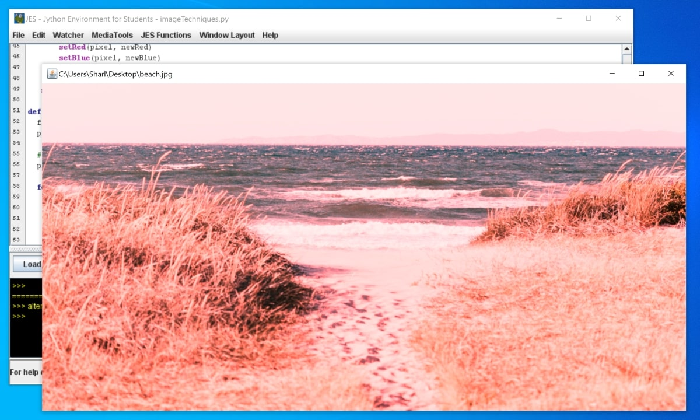

# Image-editing-techniques-JES
This is an example program showing examples of how to edit an image in JES
* Grayscale image
* Negative color filter
* Enhance red colors
* Mirrored image

## Prerequisites 

* Make sure you have JES installed on your computer.
* You can install JES from [here](https://code.google.com/archive/p/mediacomp-jes/downloads). 

## To Run

* Open the JES software on your computer.
* Go to File > Open Program  
* Navigate to where your .py file is stored
* Click on the .py file to open the program

## Example

